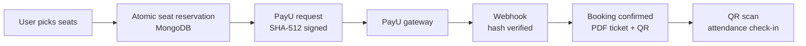

<!-- ============ HEADER BANNER ============ -->
<div align="center">


<br/>


<br/><br/>

<a href="https://linkedin.com/in/archana-thakur-9b66a4338"></a>
<a href="mailto:archanathakurs246@gmail.com"></a>
<a href="https://github.com/archanathakur86"></a>

</div>

---

### `~/about` — A bit about me

```yaml
name        : Archana Thakur
role        : Full Stack Developer
location    : Sirmaur, Himachal Pradesh, India 🇮🇳
education   : BCA @ Eternal University (CGPA 9.65 / 10) — Expected June 2027
experience  : 2 internships (Pihow Services, Codesoar Technologies)
focus       : Production web apps · RBAC & Security · Payments · AI integration
currently   : Building AI-powered products & sharpening system design
looking_for : Full-time Full Stack Developer role
```

> 💡 I don't just build UIs — I build **secure, deployable systems**: payment gateways, role-based access, webhooks, and AI pipelines that actually run in production.

---

### `~/stack` — What I build with

<div align="center">

**Frontend**<br/>
<br/><br/>
**Backend**<br/>
<br/><br/>
**Databases & Cloud**<br/>
<br/><br/>
**Tools**<br/>
<br/><br/>
**AI & Security**<br/>


</div>

---

### `~/projects` — Things I've shipped

<table>
<tr>
<td valign="top">

#### 🦉 WhySo Buddy — Voice AI Buddy for Kids &nbsp; 
Kids talk, an animated cartoon character answers back in their own language.

- 🎙️ **Speech-to-speech chat** with live voice input, spoken replies & adjustable pitch/speed
- 🎭 **5 animated SVG mascots**, with multilingual replies (English / Hindi / Hinglish)
- 🔐 **SHA-256 + bcrypt auth**, per-user chat history on SQLite & **Groq multi-model fallback**

`React` `Vite` `Node.js` `Express` `SQLite` `Groq` `Web Speech API`

[🔗 Live Demo](https://kids-ai-sts.onrender.com) · [💻 Code](https://github.com/archanathakur86/Kids-AI-STS-)

</td>
</tr>
</table>

<table>
<tr>
<td width="50%" valign="top">

#### 🧠 WhySo — AI Team Collaboration Platform
Manage projects, versioned code files, tasks & discussions with role-based access.

- Custom **LCS-based diff algorithm** for AI code review → cuts API cost, gives severity-rated risk reports
- **10+ AI features**: auto-tagging, duplicate detection, semantic search, project health scoring
- Structured **JSON-mode prompting** with Groq (Llama 3.3-70B / 3.1-8B)

`React` `Node.js` `Express` `MongoDB` `Cloudinary` `Groq`

[🔗 Live Demo](https://frontend-mu-lemon-65.vercel.app) · [💻 Code](https://github.com/archanathakur86/WhySo---AI-powered-Collaboration)

</td>
<td width="50%" valign="top">

#### 💬 Nexus AI — Secure Multimodal Chat
Conversational AI platform handling both text and image inputs.

- **Node.js reverse proxy** hides AI API credentials from the client
- Async **streaming pipeline** for sub-second token latency
- **FastAPI** service for multimodal (text + image) processing

`React` `Node.js` `Python` `FastAPI` `LLM`

[🔗 Live Demo](https://ai-assistant-murex-psi.vercel.app) · [💻 Code](https://github.com/archanathakur86/AI-assistant)

</td>
</tr>
<tr>
<td width="50%" valign="top">

#### 🎟️ Event Ticketing & RBAC Platform
Production platform built at Pihow Services, deployed on AWS EC2.

- **4-tier RBAC** with custom Express middleware
- **PayU** integration — SHA-512 signed requests + webhook verification
- **Atomic seat reservation** to prevent overbooking
- PDF tickets with **QR codes**, QR check-in, bulk email, audit logs across **9 REST modules**

`MongoDB` `Express` `JWT` `bcrypt` `AWS EC2`

</td>
<td width="50%" valign="top">

#### ☕ Luxe & Ember Cafe
High-performance cafe website — **no framework**.

- Semantic HTML, modern CSS, vanilla JS
- **98+ Google Lighthouse score**

`HTML` `CSS` `JavaScript`


[🔗 Live Demo](https://embercafe.netlify.app) · [💻 Code](https://github.com/archanathakur86/Ember-cafe)
</td>
</tr>
</table>

---

### `~/experience` — Where I've been

```text
💼 Full Stack Developer Intern   → Codesoar Technologies   (Jan 2026 – Jun 2026)
   ├─ FOA: Swiggy-style restaurant discovery & ordering platform
   │    └─ owner/admin/user roles, admin-approval onboarding, location-based discovery
   └─ CodeSoar ERP: auth, settings & clients modules
        └─ Node.js · Express · TypeScript · Drizzle ORM · PostgreSQL
        └─ JWT with rotating refresh tokens · Zod validation · RBAC routes

💼 Full Stack Developer Intern   → Pihow Services          (Aug 2025 – Dec 2025)
   └─ Independently built & shipped an event ticketing platform
        └─ Payments (PayU) · QR attendance · 4-tier RBAC · AWS EC2 deployment
```

---

### `~/impact` — What I've delivered

```yaml
access control : 4-tier RBAC enforced at route and resource level
payments       : PayU with SHA-512 signed requests + verified webhooks
data integrity : atomic seat reservation to prevent overbooking
api surface    : 9 REST modules in a single production platform
ai             : 10+ AI features in one app · Groq multi-model fallback
performance    : 98+ Google Lighthouse score on a framework-free site
deployed on    : AWS EC2 · Vercel · Netlify · Render
```

**How the ticketing platform handles a booking** — the system design I built at Pihow Services:



---

### `~/certifications` — Always learning

```text
🎓 Prompt Engineering                      → Coursera
🎓 Intro to Git and GitHub                 → Coursera
🎓 Version Control                         → Coursera
☁️  ML Foundations                          → AWS
🤖 Generative AI Foundations               → AWS
📣 Digital & Social Media Marketing        → Coursera
```

---

### `~/connect` — Let's talk

I'm actively looking for a **full-time Full Stack Developer** role. If you're hiring, building something interesting, or want to collaborate — reach out!

<div align="center">

<a href="https://linkedin.com/in/archana-thakur-9b66a4338"></a>
<a href="mailto:archanathakurs246@gmail.com"></a>

<br/><br/>


</div>
